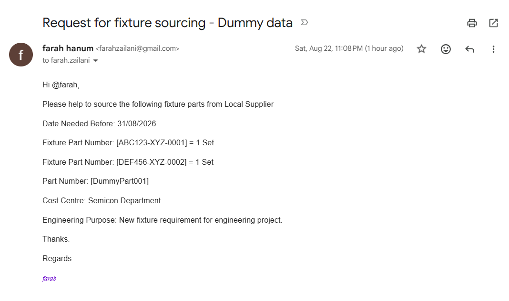
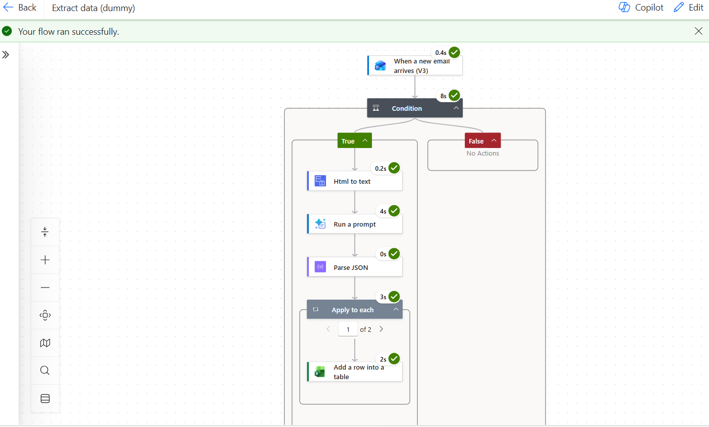
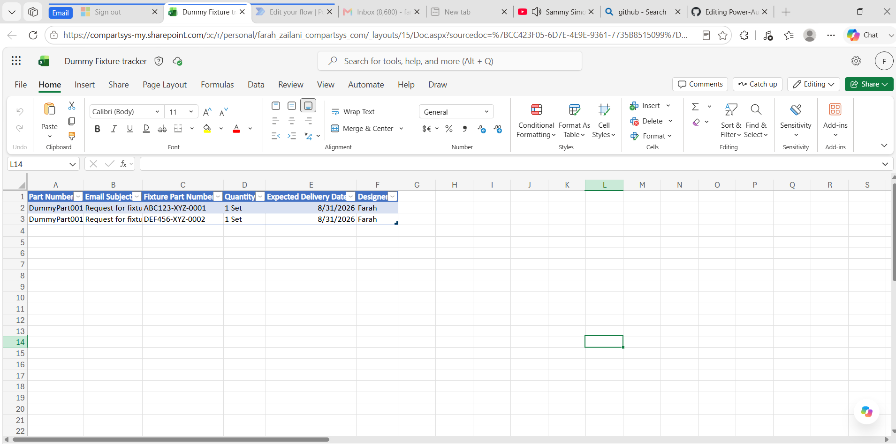

# ⚡ Automated Purchase Request & Data Extraction Pipeline
*From unstructured email → structured Excel log in seconds*

## 🎯 Problem Statement
In operational environments (Manufacturing & Engineering), purchase requests (PRs) and fixture orders are often submitted via free‑text emails.  

**Key Challenges:**
- 📋 **Manual Data Entry:** Admin teams copy‑paste details (part numbers, dates, cost centers) into spreadsheets.  
- ❌ **Human Error & Delays:** High email volume causes misplaced requests, typos, and slow turnaround.  
- ⏱️ **No Real‑Time Visibility:** Lack of centralized logs makes tracking and auditing difficult.  

---

## 💡 Solution Overview
This project automates the **email‑to‑Excel pipeline**:

1. **Trigger:** Outlook/Gmail listens for PR/Fixture emails.  
2. **Text Parsing (ETL):** Extracts dynamic fields from email body.  
3. **AI Builder Integration:** Uses GPT‑powered entity extraction for multi‑line requests.  
4. **Data Ingestion:** Populates structured Excel Online table with timestamp + status.  

---

## 🛠 Tech Stack & Tools
- ⚙️ **Automation Engine:** Power Automate  
- 📧 **Trigger Source:** Outlook / Gmail  
- 📊 **Data Destination:** Excel Online / SharePoint List  
- 🔍 **Core Concepts:** Workflow Automation, Data Extraction, Text Parsing, ETL  

---

## ⚙️ Step‑by‑Step Implementation
### Step 1: Excel Table Setup
Structured tracker with columns:  
`Part Number | Email Subject | Fixture Part Number | Quantity | Expected Delivery Date | Designer`

### Step 2: Power Automate Trigger
- Connector: Outlook/Gmail  
- Trigger: *When a new email arrives (V3)*  
- Condition: Filter sender to design team addresses  

### Step 3: AI‑Driven Extraction
- HTML preprocessing → clean text  
- LLM prompt → extract part numbers, quantities, dates, designers  
- JSON schema → handle single/multi‑item requests  
- Parse JSON + loop → insert each line item into Excel  

### Step 4: Data Insertion
- Action: *Add a row into a table*  
- Default status: `"Logged"`  

---

## 📊 Results & Business Impact
- ⚡ **Zero Manual Entry** → 100% automation  
- 🎯 **Data Accuracy** → eliminates typos in technical part numbers  
- ⏱️ **Instant Processing** → seconds instead of hours/days  

---
## 🎥 Workflow Demo

### 1. 📧 Email Input (Unstructured Request)

### 2. ⚙️ Power Automate Flow (Automation Logic)

### 3. 📊 Excel Output (Structured Log)

### 4. 🎬 Animated Demo (GIF)

### 5. 📹 Full Video Walkthrough
▶ [Watch 2‑min Power Automate Demo (Google Drive)](https://drive.google.com/file/d/1cLa2joqhBdodx-gc6o2ExKiO70NzUERm/view?usp=sharing)
---

## 🌟 Recruiter Highlights
- Automated purchase request pipeline using **Power Automate**  
- Real‑time structured logging in **Excel Online**  
- Demonstrates **ETL, JSON parsing, AI Builder integration**  
- Business impact: **zero manual entry, instant accuracy**  
